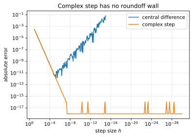

# Complex-step approximation

**Objective.** A 1D approximation without cancellation error.

## Recap

Expand $f$ at $x$ along the imaginary axis, for a real analytic $f$:

$$
f(x + ih) = f(x) + ih\,f'(x) - \tfrac{h^2}{2} f''(x) - \dots
$$

Take the imaginary part and divide by $h$:

$$
f'(x) \approx \frac{\operatorname{Im} f(x + ih)}{h}, \qquad \text{error } O(h^2).
$$



The same U-curve as the [numerical page](numerical.md)  with the complex step overlaid.

## Exercise

Implement `numeric.complex_step(f, x, h)` in [`src/easygrad/numeric.py`](https://github.com/svaiter/easygrad/blob/main/src/easygrad/numeric.py).

```python
from easygrad import numeric

numeric.complex_step(lambda z: z**3 - 2*z + 1, x=1.3, h=1e-30)
```

`f` must be written with operations valid for complex inputs (use `numpy` ufuncs and arithmetic,
not `math.sin` or `abs`).

Validate with `uv run pytest tests/test_numeric.py`.

