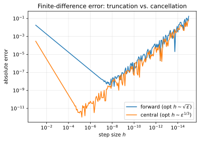

# Numerical differentiation

**Objective.** See the roundoff-vs-truncation tradeoff on a 1D function.

## Recap

A finite difference estimates the derivative from function values at nearby points:

- We can use **forward differences**

$$
\quad f'(x) \approx \frac{f(x+h) - f(x)}{h}.
$$

- or **central differences**

$$
\quad f'(x) \approx \frac{f(x+h) - f(x-h)}{2h}.
$$

A Taylor expansion shows the **truncation error** is $O(h)$ for the forward scheme and $O(h^2)$ for the central scheme, so smaller $h$ looks better.
But in floating point, subtracting two close numbers $f(x+h)$ and $f(x)$ loses significant digits: a **roundoff error** that grows like $\varepsilon/h$ as $h \to 0$.

Minimizing their sum gives an optimal step:

- forward difference: $h^\star \sim \sqrt{\varepsilon} \approx 10^{-8}$;
- central difference: $h^\star \sim \varepsilon^{1/3} \approx 10^{-5}$.



Error falls as $h$ shrinks, and starting at $h^\star$, climbs again.

## Exercise

Implement `numeric.finite_difference(f, x, h, scheme)` in
[`src/easygrad/numeric.py`](https://github.com/svaiter/easygrad/blob/main/src/easygrad/numeric.py) for the three schemes above (raise `ValueError`
on an unknown `scheme`).

```python
from easygrad import numeric

# (f(x+h) - f(x-h)) / (2h)
numeric.finite_difference(lambda x: x**3, x=1.3, h=1e-6, scheme="central")  # 3·1.3²
```

Validate with `uv run pytest tests/test_numeric.py`.
