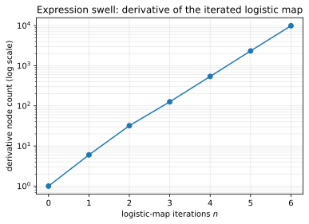

# Symbolic differentiation

**Objective.** Experience expression swell on a simple example.

## Recap

Symbolic differentiation manipulates the expression tree with the usual rules (product, quotient, chain) and returns a new expression.
It is exact but the problem is that the symbolic derivative of a function that use iteratively a multiplicative rule is far "larger" than the function itself.

For instance consider the logistic map:

$$
x_{n+1} = r\,x_n\,(1 - x_n).
$$

Its symbolic derivative $\mathrm{d}x_n/\mathrm{d}x$ before any common-subexpression elimination swells exponentially in $n$, even though the program that
computes it is just $n$ multiply-add steps.



Node count of the expanded derivative vs. iteration count $n$, on a log scale.


## Exercise

Implement `symbolic.swell_demo(max_iter)` in [`src/easygrad/symbolic.py`](https://github.com/svaiter/easygrad/blob/main/src/easygrad/symbolic.py):
iterate the provided `logistic_map` $n$ times (symbolic `x` and rate `r`), differentiate w.r.t. `x`, and record the `expression_size` (a given helper) of each expanded derivative.

```python
from easygrad import symbolic

symbolic.swell_demo(max_iter=5)
# [(0, 1), (1, 6), (2, 32), (3, 126), (4, 540), (5, 2330)]
#   ^n      ^nodes in the expanded derivative d x_n / d x
```

The exact counts may depend on your `sympy` version. Validate with `uv run pytest tests/test_symbolic.py`.
