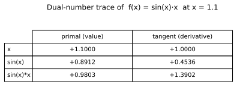

# Forward mode with dual numbers

**Objective.** Exact derivatives using the dual unit $\varepsilon$ with $\varepsilon^2 = 0$.

## Recap

A **dual number** is $a + b\,\varepsilon$ with the rule $\varepsilon^2 = 0$.
For a "smooth" $f$,

$$
f(a + 1\cdot\varepsilon) = f(a) + f'(a) \varepsilon.
$$

Indeed, every term with $\varepsilon^2$ or higher vanishes:

$$
(a + b\varepsilon)(c + d\varepsilon) = ac + (ad + bc)\varepsilon,
$$

which is the product rule in the $\varepsilon$-component.



An annotated trace of one evaluation: the **primal** and **tangent** propagate together, side by side, through each operation.

## Exercise

Implement the dual-number arithmetic and elementary functions in [`src/easygrad/dual.py`](https://github.com/svaiter/easygrad/blob/main/src/easygrad/dual.py).

```python
from easygrad import dual
from easygrad.dual import Dual

# once implemented, the same function runs on a Dual or a plain float:
def f(x):
    return dual.sin(x) * x

dual.derivative(f, 1.1)
```

You should implement in particular,

- `Dual.__add__`, `__sub__`, `__mul__`, `__truediv__`, `__pow__`, `__neg__`.
  Set the `primal` to the usual arithmetic and the `tangent` via the rule for that op.
- The elementary functions `exp`, `log`, `sin`, `cos`, `tanh`, `sqrt`.
  Propagate the tangent with the function's derivative, e.g. $\exp(a + b\varepsilon) = e^a + e^a b \varepsilon$.

Validate with `uv run pytest tests/test_dual.py`.
