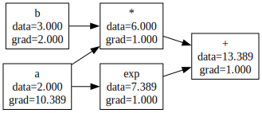

# Reverse mode with a scalar tape

**Objective.** Introduce the computational graph, topological sort, and backprop for scalar functions.

## Recap

Reverse mode flips the direction of propagation. Instead of pushing a tangent forward, we:

1. Build the graph eagerly during the forward pass. Every operation creates a new node, remembers its parents, and stores its *local* derivative.
2. Walk the graph backward. Seed the output's gradient with 1, then visit nodes in reverse [topological order](https://en.wikipedia.org/wiki/Topological_sorting), each one pushing its gradient to its parents via the chain rule.

Note that

- Gradients accumulate (`+=`, not `=`)!
- The reverse pass must respect the graph order.



The DAG for `a*b + exp(a)` with each node's `data` and `grad` annotated *after* `backward()`.
Note `a` feeds two ops, so its gradient is the sum of the two paths: $b + e^a = 3 + e^2 \approx 10.39$.


## Exercise

Implement the scalar tape in [`src/easygrad/scalar_reverse.py`](https://github.com/svaiter/easygrad/blob/main/src/easygrad/scalar_reverse.py).
The `Value` class and the derived operators (`-`, `/`) are given.
You are going to write the primitive ops, the elementary functions, `topo_sort`, and `backward`.

```python
from easygrad.scalar_reverse import Value

a, b = Value(2.0), Value(3.0)
out = a * b + a.exp()    # graph is built as these ops run
out.backward()           # reverse traversal accumulates gradients

a.grad   # should be d out/da = b + exp(a) = 3 + e^2
b.grad   # should be d out/db = a = 2
```

`Value` holds `data`, `grad`, the parents `_prev`, and a `_backward` closure.
Each op returns a *new* `Value` and pushes its local derivative into its parents:

- `__add__`, `__mul__`, `__pow__` and the elementary `exp`/`log`/`tanh`/`relu` build `out`, then define a `_backward()` that accumulates the chain-rule into each parent's `.grad`.
  For multiplication, $\partial(uv)/\partial u = v$, so `self.grad += other.data * out.grad`.
- `topo_sort(root)` return the nodes so every node comes *after* its parents (a [post-order DFS](https://en.wikipedia.org/wiki/Tree_traversal#Post-order_implementation)).
- `backward()`: topological sort, zero every grad, `self.grad = 1.0`, then call each node's `_backward` in **reverse** topological order.

Validate with `uv run pytest tests/test_scalar_reverse.py`.
