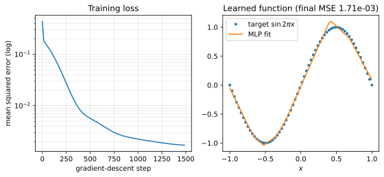

# Let's train a MLP

**Objective.** Take the reverse-mode engine from the [vector case](vector/reverse.md) and train a small neural network with gradient descent.

## A MLP

A 2-layer multilayer perceptron fitting a half-wave $y = \sin(\pi x)$ on $x \in [-1, 1]$, with a ReLU layer:

$$
\hat y = \operatorname{relu}(x W_1 + b_1) W_2 + b_2,
\qquad
\mathcal{L} = \tfrac{1}{N}\sum (\hat y - y)^2 .
$$

Every operation here is one you implemented in the [vector reverse](vector/reverse.md) exercise.
```python
import numpy as np
from easygrad import reverse
from easygrad.reverse import Node

X = np.linspace(-1.0, 1.0, 64).reshape(64, 1)
y = np.sin(np.pi * X)

def loss(W1, b1, W2, b2):
    h = reverse.relu(Node(X) @ W1 + b1)
    pred = h @ W2 + b2
    return ((pred - Node(y)) ** 2).mean()
```

Initialization is also given: standard Gaussian for $W_1, b_1$, $W_2$ scaled by $1/\sqrt H$ and $b_2$ at zero.
```python
rng = np.random.default_rng(0)
H = 16
params = [rng.standard_normal((1, H)),
          rng.standard_normal(H),
          rng.standard_normal((H, 1)) / np.sqrt(H),
          np.zeros(1)]
```

## Exercise: write the training loop

Implement `gradient_descent(loss_fn, params, lr, steps)` in [`src/easygrad/train.py`](https://github.com/svaiter/easygrad/blob/main/src/easygrad/train.py).
It should run plain full-batch gradient descent and return the final parameters together with the loss history (the loss recorded *before* each update, so `history[0]` is the loss at initialization).

```python
from easygrad.train import gradient_descent

params, history = gradient_descent(loss, params, lr=0.1, steps=1500)
```

Validate with `uv run pytest tests/test_train.py`.



Left: the mean-squared error over training, on a log scale.
Right: the learned function tracking $\sin(\pi x)$.
