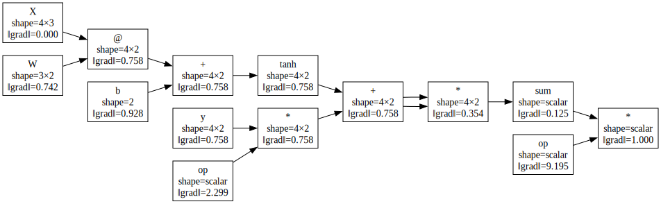

# Reverse mode over arrays

**Objective.** Backprop over `numpy` arrays, returning the gradient of a scalar-output
function.

## Recap

It is the same [tape](../scalar/reverse-tape.md) as the scalar case.
The local derivative of each node is computed as a **vector-Jacobian product** (VJP) instead of a scalar multiply.

For a primitive $y = f(x)$ where $x, y$ are arrays, the local derivative is the Jacobian $J = \partial y / \partial x$ but we don't form it in practice.
In reverse mode each node receives an *output cotangent* $\bar{y}$ (the gradient of the final scalar loss w.r.t. $y$) and produce the *input cotangent* $\bar{x}$.

$$
\bar{x} = J^{\top} \bar{y}.
$$

**Examples**:

|primitive       |VJP: $\bar x$ from $\bar y$       |
|----------------|----------------------------------|
|$y = x + t$     |$\bar x = \bar y$                 |
|$y = x \odot t$ |$\bar x = t \odot \bar y$         |
|$y = \exp(x)$   |$\bar x = y \odot \bar y$         |
|$y = A x$       |$\bar x = A^\top \bar y$          |
|$y = \sum_i x_i$|$\bar x = \bar y \cdot \mathbf{1}$|

Each primitive registers a forward value and a VJP rule.

## Exercise 1: Broadcasting and `unbroadcast`

`numpy` broadcasting makes the forward pass look shape-agnostic, but the VJP is not.
One has to ve careful about `numpy` broadcasting.
It is not because the forward pass is shape "agnostic" that the computation of the VJP is!
Indeed, suppose that you have a $(3,)$ vector that is broadcast against a $(2, 3)$ matrix, the op's output is $(2, 3)$, so the cotangent has shape $(2, 3)$ ( but the input was $(3,)$).
Thus, you have to sum the cotangent over the broadcasted axes to restore the input shape, done by `unbroadcast(grad, shape)`.

Implement `unbroadcast(grad, shape)` in [`src/easygrad/reverse.py`](https://github.com/svaiter/easygrad/blob/main/src/easygrad/reverse.py).
Return `grad` reshaped to exactly `shape`, by:

1. extra leading axes numpy prepended when `grad.ndim > len(shape)`: sum them.
2. size-1 axes in the input that were stretched in the output: sum them but keeping the dimension (`keepdims=True`).

## Exercise 2: Implement VJPs

Finish [`src/easygrad/reverse.py`](https://github.com/svaiter/easygrad/blob/main/src/easygrad/reverse.py).
You should implement the op VJPs (`__add__`, `__mul__`, `__truediv__`, `__pow__`, `__matmul__`), `Node.sum`, the elementwise `exp`/`log`/`tanh`/`relu`, and `Node.backward`.
Some parts are already implemented: the `Node` class, the matmul helpers (`_matmul_lhs_grad` / `_matmul_rhs_grad`), the reduction helper (`_restore_axes`), the topological sort, and the `grad` harness are given.
If you want an extra challenge, erase them and try to start from scratch.

```python
import numpy as np
from easygrad import reverse
from easygrad.reverse import grad, Node

# a 1-layer MLP squared-error loss
def loss(W, b):
    pred = reverse.tanh(Node(X) @ W + b)
    return ((pred - Node(y)) ** 2).mean()

gW, gb = grad(loss, argnums=(0, 1))(W0, b0)   # gradients wrt W and b, in one pass
```

`grad(f, argnums)` (given) wraps the positional arguments in `Node`s, runs `f`, checks the output is scalar, calls `backward()`, and returns the accumulated `.grad` arrays.
For people more familiar with JAX, this is like `jax.grad`.

Validate with `uv run pytest tests/test_reverse.py`.



Computational graph of a 1-layer MLP loss with shapes and gradient norms
